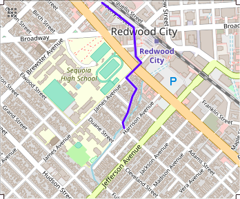
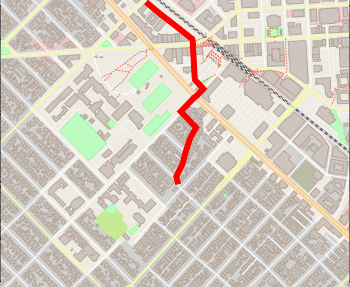
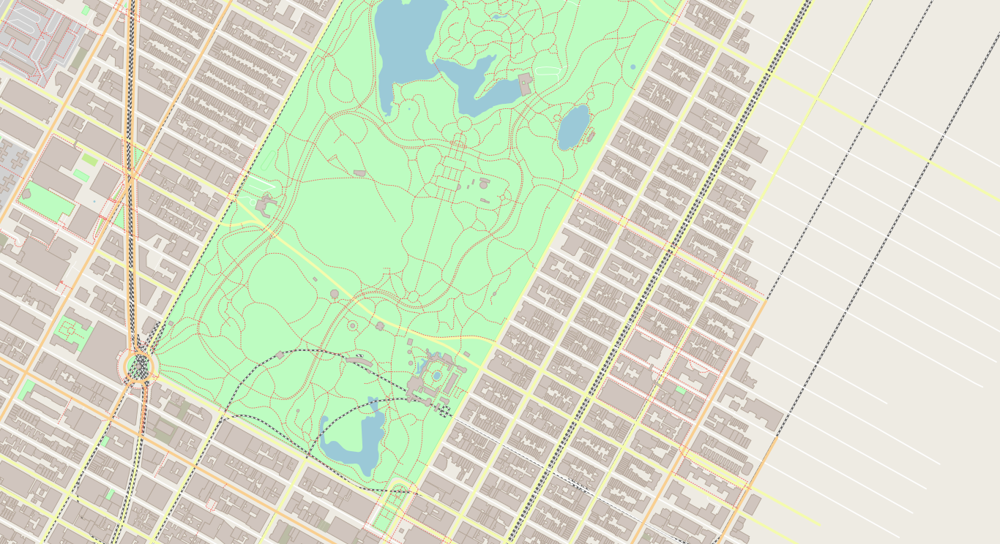

# another_route_planner

Another route planner - why do we need one when there so many both as commerical products ([Google maps](https://cloud.google.com/maps-platform/routes/), [Apple maps](https://www.apple.com/ios/maps/) and many more) and open soruce space ([Mapzen](https://www.mapzen.com/products/))? First of all it is an interesting project to work on, one can cut their teeth on so many computer science related technologies and algorithms. The second reason is that there is a strong movement towards development of open source platforms for both generating open map data  (traffic, places etc) and developing applications for it (navigation, search etc). So certainly, it is a very interesting field to enter.

I will start with the most fundamental of routing applications - going from point A to B. There are 3 major components to it
1. rendering of the map and the route graphically for easy viewing and interaction
2. calculating an optimal route 
3. Bookkeeping so that all of this runs efficiently. 

From a usability perspective, I will aim for a very simple interface - select point A (using lat/lon, or interactive map) and similarly select point B. The application will then display the route on the map. There are certain setting that the user can choose before asking for route calculation such as mode of travel - walking/driving/public transport/bicycling. I think this is a very useful feature and standard in most real-world applications. The second most desired feature is adaptive routing. I will develop some notion of what it precisely means, but the user can expect to get shortest routes based on travel time rather than shortest distance - which basically means that we will take into account traffic conditions at specific time of the day in a specific region. 


The tools and technologies I use would change depending on the difficulty of using them as well as the features they offer. Since there are some learning goals to be met, I will not necessary choose the smoothest interface/technologies. For example google offers routing API through a GET request for doing many of the routing tasks. I will not use it because then there is little opportunity to apply the different routing algorithms and get into the nitty gritty of how maps are represented for these purpose and what optimizations can one use to minimize space and maximize performance. 

Let me talk about a few technologies that will not change. I will be developing application on Linux. So naturally, for developing graphical interfaces I will use native linux or popular cross-platform frameworks. Most algorithms will be implemented in C++ so standard/widely used C++ libraries will be used - such as standard C++ library, Boost etc. Other well-known C++ libraries might also be used. Finally, for book-keeping, database management tools might be used. I am thinking of using OpenStreetMap database to obtain map information. Other tools might be used for optimizing access/use of this database - more information will follow later. 

For starters, I have implemented a routing application ([v1.1](#another_route_planner-v11)) that takes in GPS coordinates (lat/long) in decimal format for point A and B along with boundary coordinates of a square region (inside which to search). These are supplied through command line. It then generates a graphical 2D view of the map (containing streets, buildings, landuse etc) with the route superimposed on top it. Here is a usage example

```
# command line invocation of routing application
>./maps -b bounding_box start_coord end_coord  # bounding_box = lon_west,lat_south,lon_east,lat_north
```

The below table shows a comparison between routes generated by [open routing service](https://maps.openrouteservice.org/directions?n1=37.484632&n2=-122.233897&n3=16&b=2&c=0&k1=en-US&k2=km) and **another_route_planner v1**. As you can see the routes match nicely :) so far so good. I will keep you posted as things progress. If you want to use version 1 of **another_route_planner** see installation instructions below. If you want to know how I did it, read the [design doc](https://github.com/kasliwalr/another_route_planner/tree/v1/docs/Design.md)

|Open Routing Service| Another Route Planner|
:--------------:|:---------------------:
|||

## Installation

### another_route_planner v1

Version 1 uses IO2D 2D graphics library for C++ to perform map rendering. To get a jump start, I use the the demo code available from [here](https://github.com/cpp-io2d/P0267_RefImpl). This code demonstrates the use of IO2D library for rendering of open street map data, it does the job of downloading map data and rendering it on a window. Using the basic demo one can display map within rectangular GPS coordinates onto the screen. Version 1 extends this code to perform route calculation and overlay it on top of the map. I will detail the steps for installation of the demo and then the additional steps to incorporate the extensions I have provided for route calculation. 

1. Download the complete reference implementation from the repository
```
>git clone https://github.com/cpp-io2d/P0267_RefImpl.git
>git branch
*master
> tree -l .
├── appveyor.yml
├── BUILDING.md
├── cmake
├── CMakeLists.txt
├── CONSUMING.md
├── Debug
├── Design questions.md
├── LICENSE.md
├── P0267_RefImpl
├── README.md
├── temp
└── TODO.md

3 directories, 9 files
```
2. Install the dependencies: This demo has a lot of dependencies - both system and third party. Detailed instructions are provided in the `BUILDING.md`. I will take you through specific instructions relevant for my machine which is an Ubuntu 16.04 LTS. 
  
  - CMake: IO2D employs CMake as the build system. I upgraded to the cmake version 3.14 to make sure I don't have any problems. Please do so. 
```
> cmake --version
cmake version 3.14.2
CMake suite maintained and supported by Kitware (kitware.com/cmake).
```
- Configuration Variables: The following variables must be set to control the configuration process of CMake 
  - `IO2D_DEFAULT`: Controls a selection of default backend which is used when non-template symbols from std::experimental::io2d, like "brush" or "surface", are referenced. There're 5 backends in this RefImpl:
  * CAIRO_WIN32
  * CAIRO_XLIB
  * CAIRO_SDL2
  * COREGRAPHICS_MAC
  * COREGRAPHICS_IOS

  If no default backend was defined, the build script will try to automatically set an appropriate Cairo backend based on the host environment. **I did not set this, it automatically selected the default for my system (linux)**
  
  - `IO2D_ENABLED`: Specifies a list of enabled backends, which means a set of backends included in the build process.
By default, a value of IO2D_DEFAULT is used, so this variable can be left undefined. If, however, you want to have a multi-backend configuration of IO2D, this variable has to contain a valid list, for instance: "COREGRAPHICS_MAC;CAIRO_XLIB".
I did not set this either, it took the correct `IO2D_DEFAULT` value

There we other variables to control build of examples in Samples folder. I did not changes this, so it build all of the samples. ideally, modify it so that only Samples/maps is built. It will save you time when you start making changes to maps and building it, you don't want other samples to be build every time.

3. Install a fresh version of libc++. Downloaded a fresh build from [here](http://releases.llvm.org/6.0.0/clang+llvm-6.0.0-x86_64-apple-darwin.tar.xz)
```
> cd ~/
> cp ~/Downloads/clang+llvm-6.0.0-x86_64-apple-darwin.tar.xz ~/
> tar -xvf clang+llvm-6.0.0-x86_64-apple-darwin.tar.xz
> export CXXFLAGS="-nostdinc++ -isystemNEWPATH/include/c++/v1"
> export LDFLAGS="-LNEWPATH/lib -Wl,-rpath,NEWPATH/lib"
```
Export appropriate CXX and LD flags to make clang use this version of the standard library (replace NEWPATH with a path of extracted archive contents)

4. CMake scripts expect cairo and graphmagick to be installed. Install those. 
```
> sudo apt-get update
> sudo apt-get install g++-7 build-essential
> sudo apt-get install libcairo2-dev
> sudo apt-get install libgraphicsmagick1-dev
> sudo apt-get install libpng-dev
```
5. Install boost: Follow the instruction [here](https://www.boost.org/doc/libs/1_70_0/more/getting_started/unix-variants.html). I used the easy build and install option (5.1)

6. Then navigate to the cloned repo and create a Debug folder in it. It will contain the build targets
```
> cd ~/P0267_RefImpl
> mkdir Debug
> cd Debug
> cmake -G "Unix Makefiles" --config Debug "-DCMAKE_BUILD_TYPE=Debug" ../.
Default IO2D backend was not specified, choosing automatically...
Found Linux, using CAIRO_XLIB.
-- Configuring done
-- Generating done
-- Build files have been written to: /home/rk/Downloads/P0267_RefImpl/Debug
> make
```
The final make will put an executable named `maps` in `Debug/P026_RefImpl/Samples/maps` folder. You might see some errors 

7. Run the demo
```
> cd ~/P0267_RefImpl/Debug/P0267_RefImpl/Samples/maps
> ./maps -b -73.9866,40.7635,-73.9613,40.777
Downloading OpenStreetMap data for the following bounding box: -73.9866,40.7635,-73.9613,40.7775
```
A window with the following map of central park is printed




**ADDITIONAL STEPS FOR ROUTE PLANNER V1**

8. Replace all the contents of the `P0267_RefImpl/P0267_RefImpl/Samples/maps` folder with files in /src folder of **v1 branch**. This will add some modified and new files (code extensions for route calculation and rendering)
9. Add additiona recipe file names to `P0267_RefImpl/P0267_RefImpl/Samples/maps/CMakeLists.txt` in 
```
diff --git a/home/rk/Downloads/P0267_RefImpl/P0267_RefImpl/Samples/maps/CMakeLists.txt b/home/rk/repos/another_route_planner/src/CMakeLists.txt
index fdc2720..8f70c9c 100644
--- a/home/rk/Downloads/P0267_RefImpl/P0267_RefImpl/Samples/maps/CMakeLists.txt
+++ b/home/rk/repos/another_route_planner/src/CMakeLists.txt
@@ -29,6 +29,9 @@ add_executable(${PROJECT_ID}
     render.h
     http.cpp
     http.h
+    graph.cpp
+    graph.h
+    graph_search.h
 )

```

10. Redo step 6 to build

10. Run the route planner using the command line arguments below. 
```
# command line invocation of routing application
# ./maps -b bounding_box start_coord end_coord  # bounding_box = lon_west,lat_south,lon_east,lat_north
> ./maps -b bounding_box start_coord end_coord  # bounding_box = lon_west,lat_south,lon_east,lat_north
```
You should see an map with the calculated route rendered onto it. 
](https://opensource.org/licenses/MIT)
## Authors
Rishabh Kasliwal
