# Route Planner

## Table Of Contents
- [Introduction](#introduction)
- [Background](#background)
  - [OpenStreetMap Database](#openstreetmap-database)
    - [OpenStreetMap API - Accessing the Database](#openstreetmap-api---accessing-the-database)
    - [OSM-XML Database File - What is inside?](#osm-xml-database-file---what-is-inside)
  - [Map Rendering](#map-rendering)
    - [Parsing OSM-XML - Building the Model for Rendering](#parsing-osm-xml---building-the-model-for-rendering)
    - [IO2D API - Rendering the Model](#io2d-api---rendering-the-model)
 - [Requirements](#requirements)
 - [Design](#design)
   - [Architecture](#architecture)
     - [Rationale](#rationale)
     - [Module Model: Adding Route](#module-model-adding-route)
     - [Module Render: Route rendering](#module-render-route-rendering)
     - [Module Model: Generating graph from Model](#module-model-generating-graph-from-model)
     - [Module Graph_Search: A* search](#module-graph_search-a-search)
   - [Analysis](#analysis)
     - [Space Complexity](#space-complexity)
 - [Results](#results)
   - [Methodology](#methodology)
   - [Comparison of Path Generated by OSM tools vs Route Planner](#comparison-of-path-generated-by-osm-tools-vs-route-planner)
 - [Future Directions](#future-directions)
     
    
## Introduction

I am excited to talk about this project. This is version 1 of **another_route_planner**, and as the name suggests it will find a route for going from point A to point B on a given map. You should not expect it to work like google maps, its a very basic application with no GUI interactivity. Nevertheless, it contains all the basic technologies that are used in map  building and route finding. I will discuss those in the **background** section. I will then describe the **requirements**, these will serve as a roadmap, and later iterations of this project will suitably incorporate them. The **design** section describes the software architecture, design rationale, software-partioning into modules and algorithm details. When algorithms used are not custom, I will simply refer you to the relevant sources, only limiting myself to describe the parameters of interest. I will then layout system analysis results in **results**, these would include both performance and accuracy (loosely related to verification and validation). Finally, some future direction, mostly minor tweaks or improvements as we are dealing with major changes in other versions of **another_route_planner**. 

## Background

Route planning is an extremely useful practical application. You see example of its use everywhere in today's world. Route planning is required for getting from point A to B is fastest or cheapeast way as might be the goal of a taxi try to get a customer from home to a train station. Most New York taxi drivers remembered it in their heads and knew the shortest route from A to B anywhere in New York. Some really good ones, even remember which route to take when given the traffic at different times of the day. Initially GPS and now Google maps has changed that. Now anybody with access of mobile phone can go from point A to B using the best possible route - even taking into account traffic conditions. How has it become possible?
The ability to locate your position on earth using GPS (or other technologies), availability of high quality maps of places/roads/highways that precisely tell where everything is on earth (in terms of GPS coordinates) and graph algorithms which find the best routes and in fastest possible time on this large dataset (NYC zipped OSM-XML data file is [147MB](https://download.bbbike.org/osm/bbbike/NewYork/) and possibly contains millions of nodes and edges). 


OK, so we are all excited to solve this practical problem! But where do we start. There are three fundamental things that any hand-rolled route planner must do. 

1. Get the data. Talk to some database and get the high quality map data which tells you about roads, highways, lakes, buildings and all sorts of things. This data sets are very rich information sources and one must understand them reasonably well to take their full advantage. 
2. Render the map onto your screen (PC or mobile phone). You need to use some graphics library for this, there are tons of them for different systems. Since I am a Linux PC user, I will focus on those available for Linux PC. You may choose to represent only certain information that is available in the data base file. Whether or not you choose to include all data you need to convert map data into graphical objects to be rendered.
3. Develop a graph data structure that represents the map for purposes of navigation and the apply suitable graph algorithms to solve you routing problem. 

Let me lay out my choice for tackling the above 3 steps. I will use the [OpenStreetMap](https://www.openstreetmap.org/about) database for the simple reason that it is free and well maintained. I will use the experimental 2D IO library for C++, [IO2D](http://open-std.org/JTC1/SC22/WG21/docs/papers/2016/p0267r0.pdf) for rendering the map onto the screen. Let me be honest and say that these two choices came with the nice [IO2D demo](https://kazakov.life/2018/06/07/io2d-demo-maps/) by Michael Kazakov with ~800 lines of additional code on top of IO2D and 3<sup>rd</sup> libraries such as Boost and PUGIXML. In later versions, I might experiment with something new, nevertheless it might be fun to extend this demo to add some interactivity. My third choice involves the majority of design and implementation work done by me. I will detail the custom graph class and A\* search algorithm implementation to achieve route calculation. 

The basic flow of the demo is as follows
1. Download the OSM XML data from OpenStreetMap server using a http get call. 
2. Parse the downloaded XML file using 3<sup>rd</sup> [pugixml](https://pugixml.org/)
3. Convert the parsed XML to custom model representation. 
4. Render the model using IO2D API


### OpenStreetMap Database

From OpenStreetMap foundation website - "OpenStreetMap is an initiative to create and provide free geographic data, such as street maps, to anyone." I will skip over the nobel foundations of this foundation (no pun intended), you are free to go their [website]() and learn more and get to [How to get the data part](https://wiki.osmfoundation.org/wiki/How_To_Get_OpenStreetMap_Data). I will focus on two aspect, how to properly ask for data and the tools used to do that in context of this project and second, once we get the data - how to use that information, again for our purpose of rendering streets/building etc. 

#### OpenStreetMap API - Accessing the Database
You can get the data different ways. 
1. **Planet dumps**: These are files containing planet-wide map data available in OSM-XML or Planet-PBF format. They are updated weekly and can be accessed [here](). You could download them and then parse them suitably to obtain region specific information but beware, these are huge - 76GB of compressed OSM-XML file or 45GB of compressed Planel-PBF file. 

2. **OverPass API**: Defined by them as "a read-only API that serves up custom selected parts of the OSM map data. It acts as a database over the web: the client sends a query to the API and gets back the data set that corresponds to the query." This sounds more like it, I only need to obtain a small region's data at a time. However, I would need to use a network connection to obtain that data. The demo as used [OSM Editing API v0.6](https://wiki.openstreetmap.org/wiki/API_v0.6). 


**OSM Editing API** is a RESTful API, which means that we can make http GET/SET/PUT etc requests to it. We compose a GET request by defining the host - "api.openstreetmap.org"  and resource identifier "/api/0.6/map?bbox=longMin, latMin, longMax, latMax" for accessing all osm data within the rectangular bounding box defined by gps coordinates in decimal form. 

Just to test it, I used the `wget` utility on my machine, to download the data into a file `target.osm` like so

```
wget -O target.osm https://api.openstreetmap.org/api/0.6/map?bbox=8.81598,47.22277,8.83,47.23
```
The data is returned in [OSM-XML](https://wiki.openstreetmap.org/wiki/OSM_XML) format. Here is snippet of the `target.osm` file. Notice that it is in XML. 

```
<?xml version="1.0" encoding="UTF-8"?>
<osm version="0.6" generator="CGImap 0.6.1 (24071 thorn-01.openstreetmap.org)" copyright="OpenStreetMap and contributors" attribution="http://www.openstreetmap.org/copyright" license="http://opendatacommons.org/licenses/odbl/1-0/">
 <bounds minlat="47.2227700" minlon="8.8159800" maxlat="47.2300000" maxlon="8.8300000"/>
 <node id="26033718" visible="true" version="3" changeset="13977066" timestamp="2012-11-21T23:57:28Z" user="dbrgn" uid="317694" lat="47.2225565" lon="8.8156618"/>
 <node id="26034189" visible="true" version="15" changeset="14838901" timestamp="2013-01-29T19:30:00Z" user="Schnupfix" uid="72918" lat="47.2283761" lon="8.8170414"/>
 <node id="26034190" visible="true" version="15" changeset="14838901" timestamp="2013-01-29T19:30:00Z" user="Schnupfix" uid="72918" lat="47.2281306" lon="8.8163280"/>
 <node id="26034191" visible="true" version="16" changeset="14838901" timestamp="2013-01-29T19:30:01Z" user="Schnupfix" uid="72918" lat="47.2275740" lon="8.8139556"/>
 <node id="26034192" visible="true" version="15" changeset="6667030" timestamp="2010-12-15T12:31:10Z" user="zwis" uid="177149" lat="47.2271008" lon="8.8119896"/>
 <node id="26034193" visible="true" version="17" changeset="44195121" timestamp="2016-12-05T23:16:30Z" user="Sal73x" uid="1293386" lat="47.2269186" lon="8.8114864"/>
 <node id="26034194" visible="true" version="16" changeset="13977066" timestamp="2012-11-21T23:57:28Z" user="dbrgn" uid="317694" lat="47.2267289" lon="8.8117687"/>
 <node id="26034195" visible="true" version="16" changeset="13977066" timestamp="2012-11-21T23:57:28Z" user="dbrgn" uid="317694" lat="47.2262120" lon="8.8133895"/>
 <node id="29773941" visible="true" version="4" changeset="14043290" timestamp="2012-11-26T11:13:00Z" user="SimonPoole" uid="92387" lat="47.2266415" lon="8.8184177">
  <tag k="highway" v="traffic_signals"/>
 </node>
```

There are a number of way to work with a restful API. In our case, IO2D demo uses a custom wrapper atop [Boost.Beast](https://www.boost.org/doc/libs/develop/libs/beast/doc/html/index.html) networking library to make the http requests for OSM map database. I will not into the specifics of that except the fact that it establishes a connection with the OSM data server, makes GET request to obtain in response OSM data as XML, converts OSM-XML into byte buffer and then keep it in memory until further use. Next we learn, how to parse this OSM-XML database file. 


#### OSM-XML Database File - What is inside?


### Map Rendering


#### Parsing OSM-XML - Building the Model for Rendering


#### IO2D API - Rendering the Model


### Downloading OSM XML

#### What is OSM XML?

OSM data is availble to us in [OSM-XML](https://wiki.openstreetmap.org/wiki/OSM_XML) format. This format is the de-facto standard for working with OSM data and is heavily used for tools in the OSM universe. The XML format is basically a list of 3 data primitives - [nodes, ways and relations](https://wiki.openstreetmap.org/wiki/Elements)
1. Nodes: A node represents a specific point on the earth's surface defined by its latitute and longitude. Nodes can define a single location or then can be part of way where they can represent many things - such as points along a road, points along the perimeter of a building a water body and so on.
2. Ways:  Way is an ordered list of between 2 and 2000 nodes that define a polyline. They usually represent rivers and road or somewhat linear structures. They can also represent boundaries of areas, in this case the first and last element is the same resulting the ordered list in being a polygon. This is used to represent buildings and forests. 
3. Relations: A relation is a multi-purpose data structure that documents a relationship between two or more data elements (nodes, ways, and/or other relations). A relationship can be of any type - such as things related by being part of a route, two roads can be related by having a turn restriction between them. The relations meaning is identified by its `tag` field.
The relation is structured as an ordered list of elements (nodes, ways or other relations). These elements may appear multiple times. Each element can optionally have a `role` field within it. 

#### Why learn about OSM XML?
OSM XML is a rich data set containing a variety of information. For the purposes of this project, we need to understand how building and roads are represented in the data structure so that we can use them effectively. Infact, this has already been accomplished in the demo, we can study it and possibly extend the XML parsing to add more information on the map. The key to do that is understand the data structure where the data is coming from i.e. OSM XML

#### How is OSM-XML downloaded?
OpenStreetMap has an [API](https://wiki.openstreetmap.org/wiki/API_v0.6#Capabilities:_GET_.2Fapi.2Fcapabilities) which lets you download map data specified by an arbitrary coordinate bounding box. The demo uses [Boost.Beast](https://www.boost.org/doc/libs/develop/libs/beast/doc/html/index.html) networking library of Boost to send an HTTP GET request to the OSM server to download the data. 

### Parsing OSM XML

#### What is PUGIXML?

[PUGIXML](https://pugixml.org/) is light-weight C++ XML processing library. 

The complete pugixml source consists of three files - one source file, pugixml.cpp, and two header files, pugixml.hpp and pugiconfig.hpp. pugixml.hpp is the primary header which you need to include in order to use pugixml classes/functions.

The parsing works by converting the XML file to a in-memory buffer. The pugixml api `load_buffer` is used to read the buffer into an `xml_doc` object. A [XPath1.0](https://en.wikipedia.org/wiki/XPath#Syntax_and_semantics_(XPath_1.0)) [query](https://pugixml.org/docs/manual.html#xpath) is then used to walk the xml tree and parse relevant information. I will not go into the implementation in further detail as I will not need to extend the demo implementation. 

#### How is parsed OSM XML stored
In the demo, a  custom model is developed to hold relevant information. During walking the XML tree, a lot of information is discared and only the relevant information for the model is kept. The model only stores nodes and ways that are part of the following real world features
1. landuse
2. water
3. building
4. leisure areas
4. roads
5. railways

Since there are many of each kind they are stored as vectors. Each features points to a data primitive such as a multi-polygon or a way. The data primitives are also stored as vectors. This is succintly represented using the figure below.

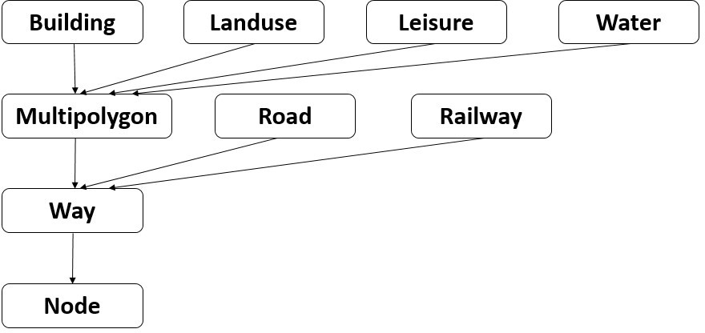

Later when discussing the design, I will talk about how to extend the model to accomodate a route feature. 


### Rendering the Model

If one wants to render a particular feature on the screen, one would first need to convert the feature and consequently the data primitives that it points to, to a representation understood by IO2D API. This is accomplished by couple of custom functions in the demo. Some additional information such as color and line-style is also passed to the IO2D API. To control the rendering the object are rendered in a certain order. For example roads are render after landuse. LAter when discussing the design, I will talk about how to extend the rendering code to display a route on the map. 


#### IO2D API

// TODO


## Requirements
//TODO

## Design

### Architecture

I have used almost the same architecture as IO2D demo. The major difference is that two new modules `graph` and `graph_search` have been added. In addition, modules `render` has been modified and module `model` has been subtantially extended. The images below shows the call graph for the IO2D demo and my version

|IO2D DEMO|CURRENT VERSION|
:--------:|:-------------:
|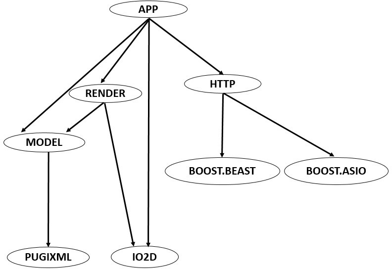|  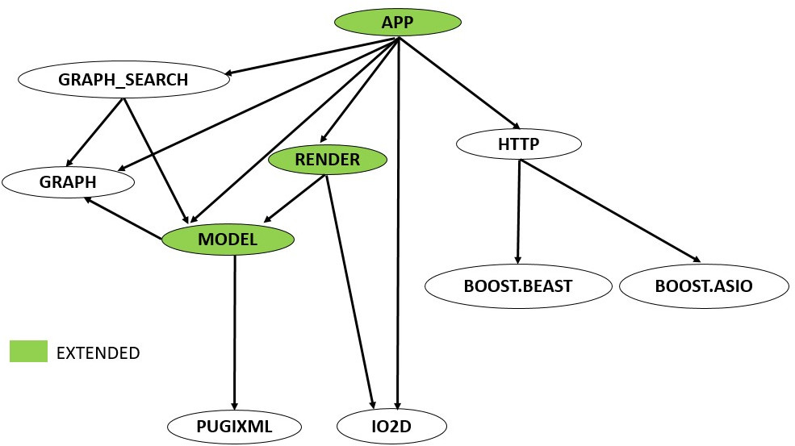|

#### Rationale
We need to extend the `model` class to reprsent route. A route can only exist on different types of roads. In general, a route can be composed solely from ways, therefore, in the database model, we need an additional real world features - `Route`. This feature should point to a single way which is composed of nodes along the route.This special way is generated by a path finding algorithm and stored in `vector<ways>` inside the `model` class. 

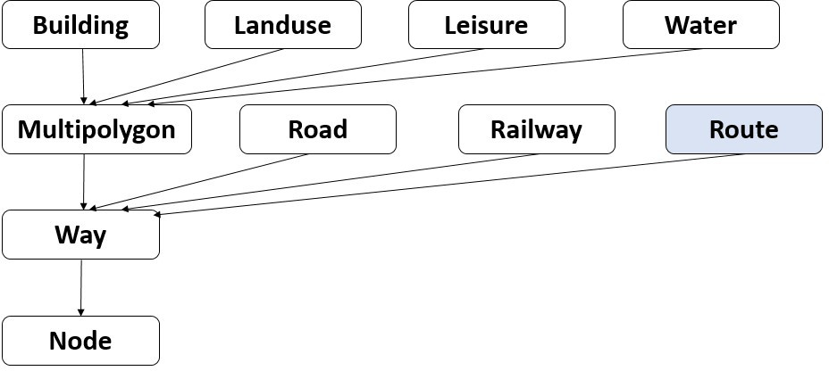

We also need to extend the `render` class. The `render` class is responsible to generating the drawings for each of the features types in the object model, we need to add additional methods/properties in it to render the newly added `Route` feature. 

We have allowed for model and render class to be extended to accomodate a new feature `Route`, but we also need to calculate the route. We should treat the map as a collection of nodes connected by navigable paths - these paths could be roadways (residential streets, city roads and highways) as well as walkable paths. A collection of nodes connected by navigable paths can naturally be reprsented as a weighted graph (directed or undirected). These will allow us to apply the many graph search algorithms such as depth-first, breadth-first, Dijkstra, Floyd-Warshall and A\* search which will provide us the shortest path to take between two points on the map. I have added two additional modules and extended the `model` class further. There is a `graph` module which defines a weighted graph class. There is a `graph_search` module which will contain all the different graph search algorithms. In addition, since we need to convert the map to a graph, there will be additional methods in `model` class (which maintains a relevant representation of the map as a database model) to translate the model to a graph object.  

The following subsection describe these changes to these different modules in detail

#### Module Model: Adding Route

```diff
  #include <vector>
 #include <unordered_map>
 #include <string>
 #include <cstddef>

 class Model
 {
 public:
struct Way {
        std::vector<int> nodes;
    };


+    struct Route {
+       int way;
+    };
+     
     Model( const std::vector<std::byte> &xml );

     auto &Waters() const noexcept { return m_Waters; }
     auto &Landuses() const noexcept { return m_Landuses; }
     auto &Railways() const noexcept { return m_Railways; }
+    auto &Routes() const noexcept {return m_Routes;}
 private:
     std::vector<Way> m_Ways;
```

The model API is extended by creating a new structure `Route`. In terms of design it is exactly the same as a `Roadway`. It has an integer field called `way` which contains the index of elements in `m_Ways` (a `vector<Way>`) that correspond to the route. `Way` is an ordered list of nodes. We also add a getter `Routes()` to access m_Routes which is a vector that holds many routes. In our case this will only contain a single route but I have tried to be consistent here, there is no loss of space in doing so. 

#### Module Render: Route rendering
```diff
void Render::Display( io2d::output_surface &surface )
{
     DrawRailways(surface);
     DrawHighways(surface);
     DrawBuildings(surface);
+    DrawRoutes(surface);
}

void Render::DrawHighways(io2d::output_surface &surface) const
{
    auto ways = m_Model.Ways().data();
    for( auto road: m_Model.Roads() )
        if( auto rep_it = m_RoadReps.find(road.type); rep_it != m_RoadReps.end() ) {
            auto &rep = rep_it->second;
            auto &way = ways[road.way];
            auto width = rep.metric_width > 0.f ? (rep.metric_width * m_PixelsInMeter) : 1.f;
            auto sp = io2d::stroke_props{width, io2d::line_cap::round};
            surface.stroke(rep.brush, PathFromWay(way), std::nullopt, sp, rep.dashes);
        }
}

+void Render::DrawRoutes(io2d::output_surface &surface) const
+{
+    auto ways = m_Model.Ways().data();
+    for( auto &route: m_Model.Routes() ) {
+        auto &way = ways[route.way];
+        auto path = PathFromWay(way);
+        surface.stroke(m_RouteBrush, path, std::nullopt, io2d::stroke_props{m_RouteWidth}, io2d::dashes{});
+    }
+}
+
```


// TODO: description

#### Module Model: Generating graph from Model 

We extend the Model API as shown below

```diff
+#include <map>
+#include <unordered_set>
+#include "graph.h"

public: 
+    void generateGraph(graph::GraphWAL & g);
+    float eucledianDistance(int, int);
+    void addSrcDestn(std::string src_string, std::string destn_string);
+    int Src(){return nodeToVertex[src_node];}
+    int Destn(){return nodeToVertex[destn_node];}    
+    void addRoute(std::vector<int> gVertices); 
```

1. `void generateGraph(graph::GraphWAL & g)`: The only navigable feature in the map-model is Road. We are interested in the `Way` object that it points to in the `m_Ways` vector. Once we find such a way, we will visit each node on it and add it to the vertices of a graph. The distance between consecutive nodes in a `Way` object is the eucledian distance between the objects - this distance is the edge weight. Once we are done with one road, we move to the next and repeat this process. This is how we build a weighted graph representation. 
```
struct Road{
int way
Type type;
}
```
Once the graph build is complete, it is maintained in memory until the application terminates. One can imagine, that we may need to find different routes in the same map repeatedly. The two most important API for the graph are shown below
```
class GraphWAL: GraphAL
{
 public:
  std::vector<int> neighbours(int) const;
  std::map<int, float> edgeWts(int) const;
}
```
`neightbours` returns all the directly connected nodes to a given node in a graph. `edgeWts` returns all directly connected nodes to a given node and the corresponding edge weights between them. These two APIs will be heavily used during graph search. Note that the vertex indices of the graph and indices of nodes in `m_Nodes` vector in `Model` class are not the same. A lookup table is maintained in the Model, that allows it to convert graph provided indices back to node indices for rendering purposes. 

2. `int Src()` and `int Destn()`: These two methods provided the indices of the graph corresponding to source and destination nodes in the Model. 

3. `void addSrcDestn(std::string src_string, std::string destn_string)`: This is simply a helper function that basically add user provided source and destination (in format "lat,lon") to nodes list. In actuality, it find the nearest node in the `m_Nodes` vector and notes its index for both the source and destination node. 

4. `void addRoute(std::vector<int> gVertices)`: This method is provided a vector of graph vertices that form a path from source to destination. It then uses model's internal vertex-to-node map to determine the model `Nodes` lying on the path. These nodes are used to construct a `Way` object to which the `Route` feature points to. 

5. `float eucledianDistance(int, int)`: This method measures the eucledian distance between any two model nodes. It is a public method because it is required by A\* as a heuristic. 

#### Module Graph_Search: A* search

A* search is used for performing searching on the weighted graph generated from the model. It is faster than Dijkstra's algorithms (or BFS/DFS) on account of visiting fewer nodes. Like Dijkstra's algorithm, it adds one node to the visited set of nodes at each iteration and defines its parent. Unlike Dijkstra's it not only considers the cost to reach that node from the visited set but also the cost to go from the node to the destination node. This cost is estimated, and is provided by the heuristic function. 

A* search is a popular algorithm in path-finding. For detailed overview of A\* visit this excellent tutorial [here](http://theory.stanford.edu/~amitp/GameProgramming/)

The module's API consist of a single method that performs A\* search and associated data structures for its use
```
std::vector<int> astarSearch(Model, Modelfunc p_heuristic, GraphWAL& g, int src, int destn)

//pointer to Model member function
typedef float (Model::*Modelfunc)(int, int); 
```

The A\* search method takes in Model and Graph as parameters. The only reason, it takes in model is to access its member methods that returns heuristic cost of traveling between any node and destinaton node. The member method we pass the `eucledianDistance(int, int)`. The graph structures is naturally passed as A* search needs to access its vertices and edge weights to perform the search. Finally, we also pass two integers, these are graph vertex indices representing source and destination node. Obviousy somebody needs to translate a Model src and destination node to graph vertices. This is the job of `int Src()` and `int Destn()` member functions of `Model` class. 

I will not go into detail of A\* implementation as it is pretty standard. The only thing to node is that I am using eucliedian distance as heuristic. This is [recommended](http://theory.stanford.edu/~amitp/GameProgramming/Heuristics.html) for grid like graphs which is the structure of city roads. One could potentially come up with better heuristics. Another thing I payed attention to when designing the heuristic is that it has the same units as the cost of visiting from visted set of notes to a given node. Both are measured as eucledian distance and have units of distance. 

### Analysis

#### Space Complexity:

1. OSM data files are large running into GB. In this project, we only tackle smaller regions, so we are downloading and using a few 10s of MB of data at a time which is pretty manageable. This can run into 50,000 OSM nodes
2. Model: The model discards a lot of data. It is talked about [here](https://kazakov.life/2018/06/07/io2d-demo-maps/
). It maintains a set of linear containers. There are linear containers for nodes and ways. There are also linear containers for real-world features such as roads, landuse etc. All these other containers usually point to way (based on the data model). So the space taken up is of the O(number of ways) i.e. linear in the number of ways. Since ways not have many nodes in common, this comes out O(number of nodes) roughly. I have however not done strict analysis or emperical determination
3. Graph: The graph used a weighted graph, so the space complexity is O(|E| + |V|). A grid like structure is a sparse graph, so one could say spac complexity is O(|V|) or number of nodes in the Model. 
4. Graph_Search: During graph search we maintain a priority queue which can potentially be the size of the number of nodes. It is usually much less than that. One can safely say that it too is O(|E|). 

## Results

### Methodology
To measure performance of my implementation, I compare it for accuracy against the well-known openstreetmap route finder. I look for the fact that route generated by roughly similar i.e. roughly equal in length. This is the case because sometime routes are equivalent in length and either one is correct, so results may not exactly match. Since the current implementation focuses on walkable routes, I will compare walkable routes. The below table shows routes between different starting and ending points on a map of Redwood City, CA


To compare image for route planning from open stree map [openroute service](https://maps.openrouteservice.org/directions?n1=37.484692&n2=-122.232159&n3=16&a=37.48153,-122.233801,37.487658,-122.235217&b=2&c=0&k1=en-US&k2=km) was used. The generated path was downloaded as *gpx* file and then superimposed on a map of the city using [MyOSMatic](https://print.get-map.org/new/) map creater. It allows to select a bound box around the route. The limits of the bounding box were used as input of `./maps` executable like so  `./maps -b bounding_box start_coord end_coord`
The starting and ending coordinates in decimal were determined from the openroute service page by clicking on the starting and ending locations. 
The pop-up window generated by maps, was superimposed on the MyOsmatic bounding regions to generate perfect correspondence between the two -images

### Comparison of Path Generated by OSM tools vs Route Planner

|OSM Path|OpenStreetMapper Path|
|--------|---------------------|
|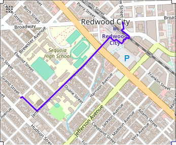|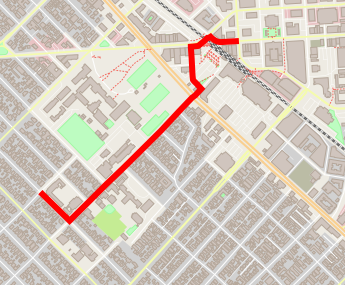|
|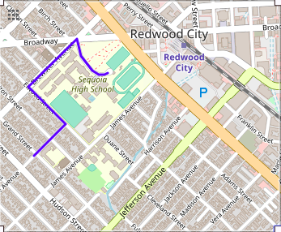|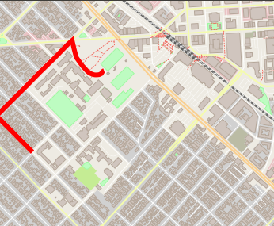|
|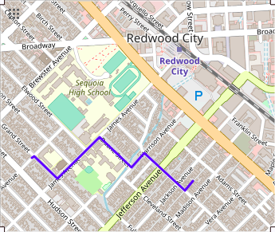|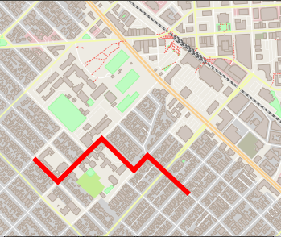|
|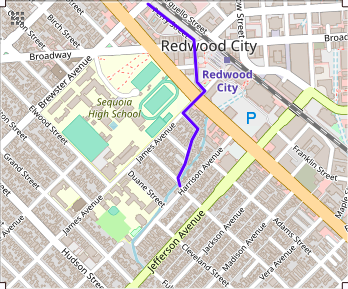|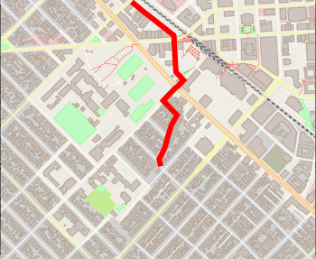|

There are two kinds of discrepencies in the route generated by OSM vs OpenStreetMapper. First is that in some cases routes are different such as figure two, but these seem to be equivalent in terms of distance travelled. So the algorithm chose the one that turned out of be different from OSM one. Secondly, you may notice in Figure3 that the OpenStreetMapper does not navigated to the point but stops before it, this is due to the fact that in our model we try to find navigable path between node nearest to the specified coordinates. If a coordinates is in the middle of a straight road (which can be represented by only two points) then I choose the end of the road which is nearest to the location as the destination. This is what we are seeing in Figure 3. If you remove this restriction, i.e. mark location that are at road intersections, the route match pretty well as is the case in Figure4. 

//TODO: add section summary


## Future Directions
There are many directionss one can take. In general there are variety of metrics to route between two points such as travel time (as in google maps), pedestrain friendly routes. Also, there are many types of constraints that one needs to take into account, these can be incorported as well. I will not discuss them here but keep looking at the repos README for improved versions of this project. 

Another area for improvement is replacement of hand-rolled code with libraries - for examples I hand-wrote A\* search, graph data structure etc. These are handled well using Boost library. Also since we built this on IO2D demo we used the underlying graphics facilities provided by it - we will explore its interactivity features, but also try to use other well established GUI tools such as Qt framework. 


## References
- [IO2D Demo](https://kazakov.life/2018/06/07/io2d-demo-maps/)
- [IO2D Reference Implementation](https://github.com/mikekazakov/P0267_cg)
- [A\* Search Overview](http://theory.stanford.edu/~amitp/GameProgramming/)
- [Open Street Map Database](https://www.openstreetmap.org/export#map=17/37.48202/-122.22500)
- [OSM-XML Overview](https://wiki.openstreetmap.org/wiki/OSM_XML)


